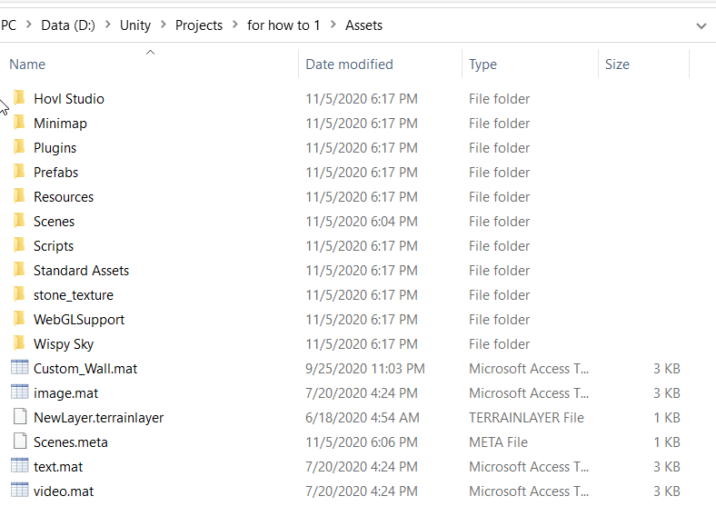

# Overview

1. Create a new project
2. Copy and Paste my files
3. Add the tag and layer
4. Create the map and the navMesh

# Some simple steps

1. [Starting a new scene](#starting-a-new-scene)
2. [Add the nesesery components](##add-the-nesesery-components)
3. [Setting up the map](#adding-the-map-and-making-the-navigation-path)

## Starting a new scene

1. Download Unity Hub
2. Start Unity Hub
3. Install the 2019.4.11f1(LTS) version of Unity with **WebGL Support**
4. Login or Register an account
5. Create a New 3D Project

[You can see a tutorial here](https://www.youtube.com/watch?v=Y7zjEQrJVzY)  
Be carefull though!!  
During the installation of Unity you need to check the
**WebGL** support as mentioned  
You don't need Android  
Also you don't need Visual Studio so you can uncheck them both
from the list if you want  

## Add the nesesery components

You have succesfully created a new Project  
Now you need to set up some things for it to work  

1. Navigate to the folder that you decided to store your project
2. Download the *Packet For Download* and extract all the folders in it
3. Copy and Paste all of them inside your **Assets** folder:
   - Hovl Studio
   - Minimap
   - Plugins
   - Prefabs
   - Resources
   - Scripts
   - Standard Assets
   - stone texture
   - WebGL Support
   - Wispy Sky



4. Add a layer called **minimap**


5. Add a tag called **target**


6. From Prefabs drag and Drop everything in our scene and unpack them


7. Delete Main Camera from the Hierarchy


## Adding the map and making the navigation path

For adding a map in Unity there are 3 options:  

- Creating the map within Unity3D Editor from scratch
- Importing a map from other software
- Compining the above

There are pros and cons to eatch method

Creating a map using the Unity3D Editor gives you the ability to
use all the Unity's editor features but implies that
you know how to use it and for many people that's not the case.

If you want to import it from another 3D software you will lose a lot of features
that Unity provides such as the Terrain Object (we will see that)

So many developers combine this methods and use them to maximize their productivity

Here you can see the 3rd method take place:

1. Copy and Paste your map with the textures folder in the Prefabs folder


2. Drag and Drop the map inside the Hierarchy and Unpack the prefab (where you deleted the Main Camera)


4. Find the tairen in the Hierarchy by clicking the floor in your Scene

5. While the floor is selected go to the inspector(left)->Add Component and type
Mesh Collider Enter


6. Now while the floor is selected go to Window(up right)->AI and click Navigation


7. After that a navigation tab will open in the left of your screen

8. While the floor is selected again check the Navigation Static box


9. Go in the Bake tab inside navigation and press bake


10. Unity will figure out the floor and make it walkable for our player

## Specifing the obstacles of our player

1. Select all the houses, walls, objects from your imported map that you want to behave like real objects (A quick way is to find them in the hiererchy and select them with Ctrl + Click)

2. Inspector -> Add Component -> Mesh Collider


3. In the ispector -> Navigation -> Navigation static -> !!!Specify Not Walkable and then bake like the last time


## Making the map more beautiful

Here is where the problem with the first method beggins. A really nice feature the Unity has is the Terain Object
If you build your map on top of a Terain Unity gives you the ability to add textures, trees, water and many more stuff
pretty easy.

So if you choose not to use terrains, you will have to rely on you 3D program of preference or the Unity Asset Store to make 
or download new Assets

With some Unity magic and using some of the Terrain's features we can make our game beatuful
I deleted the floor and kept only the houses an the wall and placed them on top of the Terrain, added some textures and lighting and...


## Playing the Game inside Unity

Our Game can be played inside of Unity for Testing perposes with just clicking the play button
If you want to test all of the modes you can do that by changing the contents of .json. But be careful
don't put 2 true values inside cause it will give an error (won't affect the build tho).

## Building the WebGL

1. Go to File -> Build Settings


2. Select WebGl (probably you will need to press the Switch Platform button too else skip to the next step)


3. Click Build, select a file for the build to be stored in and you are all set


## Uploading the WebGL to the site

1. Zip the files from the build and upload them into our website


## Some problems


```json
image 18 is wrong
you didn't check the webgl box  
tags problems Media, target, current_priority, current_type, current_url,
current_description  
player falls from the floor
```
