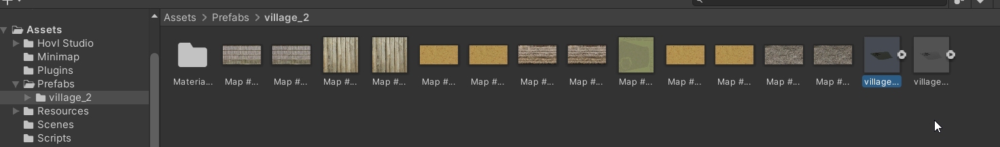
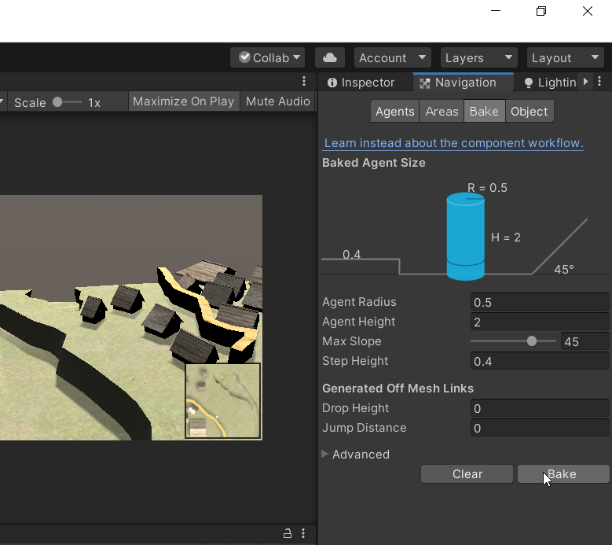

# Overview

1. [Create a new scene](#creating-a-new-scene)
2. [Add the nesesery components](#adding-the-nesesery-components)
3. [Set up the map](#adding-a-map-and-creating-the-navigation-path)
4. [Specify the obstacles of your player](#specifing-the-obstacles-of-our-player)
5. [Polish some edges](#making-the-map-more-beautiful)
6. [Want a test drive?](#playing-the-game-inside-unity)
7. [Build the Project](#building-the-webgl)
8. [Upload the Game](#uploading-the-webgl-to-the-site)

## Creating a new scene

1. Download Unity Hub
2. Start Unity Hub
3. Install the 2019.4.11f1(LTS) version of Unity with **WebGL Support**
4. Login or Register an account
5. Create a New 3D Project

[You can see a tutorial here](https://www.youtube.com/watch?v=Y7zjEQrJVzY)  
Be carefull though!!  
During the installation of Unity you need to check the
**WebGL** support as mentioned  
You don't need Android  
Also you don't need Visual Studio so you can uncheck them both
from the list if you want  

## Adding the nesesery components

You have succesfully created a new Project  
Now you need to set up some things for it to work  

1. Navigate to the folder that you decided to store your project
2. Download the *Packet For Download* and extract all the folders in it
3. Copy and Paste all of them inside your **Assets** folder  
Your **Assets** folder must look something like:


4. Add a layer called **minimap**


5. Add a tag called **target**


6. From the Prefabs folder drag and drop everything in our scene. Then unpack them
completly


7. Delete the Main Camera from the Hierarchy


## Adding a map and creating the navigation path

For adding a map in Unity there are 3 options:  

- Creating the map within Unity3D Editor from scratch
- Importing a map from other software
- Compining the above

There are pros and cons to each method:

1. Creating a map using the Unity3D Editor gives you the ability to
use all of the Unity Editor's features but requires spending a lot
of time figuring out how Unity works.

2. Importing a map from other 3D software, will make you lose a lot of features
that Unity provides, such as the Terrain Object (we will see that)

3. So many developers combine this methods and use them to maximize their productivity

Let's first see how to impliment the second method

1. Copy and Paste the folder that you stored your map in the folder: Prefabs


2. Drag and Drop the map inside the Hierarchy (where you deleted the Main Camera)
and unpack the prefab completly




4. Click the floor in your Scene

5. While the floor is selected go to the Inspector -> Add Component
and type: Mesh Collider. Then press Enter.


6. While the floor is selected go to Window -> AI and click Navigation


7. After that a navigation tab will open in the left of your screen

8. While the floor is selected again check the Navigation Static box
and select the Walkable option


9. Go in the Bake tab inside navigation and press bake



10. Unity will figure out the floor and make it walkable for our player

## Specifing the obstacles of our player

1. Select all the houses, walls, objects, etc. from your imported map that you 
want to behave like real objects
(A quick way to do that is to find them in the hiererchy and
select them with Ctrl + Click)

2. In the Inspector -> Add Component and type: Mesh Collider. Then press Enter


3. Again in the Ispector click the Navigation tab -> check the Navigation
static box!!!Specify Not Walkable and then bake like the last time


## Making the map more beautiful

Here is where the problem with the second method beggin.
A really nice feature that Unity has, is the Terain Object.
If you build your map on top of a Terain, Unity gives you the ability to add textures,
trees, water and many more things without complications.

If you choose not to use terrains, you will have to rely on you 3D program
of preference or the Unity Asset Store to make or download new Assets.

With some Unity magic and using some of the Terrain's features we can make our
game beautiful.
I deleted the floor and kept only the houses and the wall. I placed them on
top of the Terrain, added some textures and Post Procecing effects and...


If you want to learn how to use the terrain and make your game look beautiful
some useful resources are:  
[Gorgeous terrain is SUPER EASY](https://www.youtube.com/watch?v=aQUJ9qMMhlQ)  
[How to make Terrain in Unity](https://www.youtube.com/watch?v=MWQv2Bagwgk)  
[Using Post-Processing to improve visuals in Unity](https://www.youtube.com/watch?v=_PzYAbPpK8k)

## Playing the Game inside Unity

Our Game can be played inside Unity for testing purposes with just clicking
the play button. If you want to test all of the modes you can do that by changing
the contents of example.json, the location of this file is in Assets/Resources.
But be careful don't put 2 true values inside cause it will break the game
until you change it back (Won't affect the build).

## Building the WebGL

1. Go to File -> Build Settings


2. Select WebGl (probably you will need to press the Switch Platform button too
else skip to the next step)


3. Click Build, select a file for the build to be stored in and you are all set


## Uploading the WebGL to the site

1. Zip the files from the build and upload them into our website


```json
```
